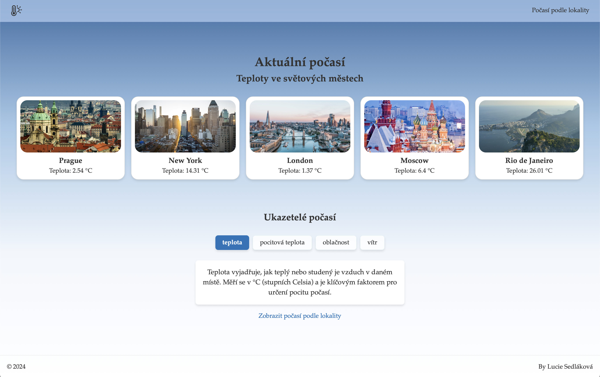
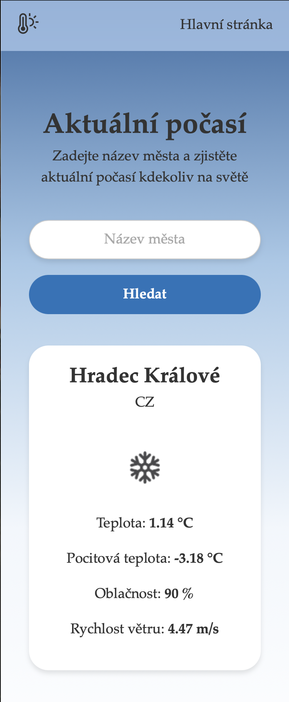

# Weather app 🌦️
## Popis
Aplikace pro zobrazení aktuálního počasí, postavená na Reactu a stylovaná v CSS. Homepage zobrazuje aktuální počasí pro pět vybraných hlavních měst a v sekci Ukazatelé počasí mohou uživatelé přepínat mezi různými meteorologickými parametry pomocí toggle tlačítek, čímž se mění zobrazený obsah. Na druhé stránce lze zadat jakékoukoliv lokalitu na světě a získat aktuální data prostřednictvím API.  

**Live Demo:**  
https://sunandstorm.netlify.app

## Spuštění projektu
Pro spuštění této React aplikace je potřeba mít nainstalovaný Git a Node.js (včetně npm). Postupujte následovně:
```bash
# Naklonujte tento repozitář
https://github.com/SedlakovaLucie/weather_app.git

# Vstupte do vytvořené složky
cd weather_ap

# Nainstalujte
npm install

# Spusťte aplikaci
npm start
```
## Screenshots




